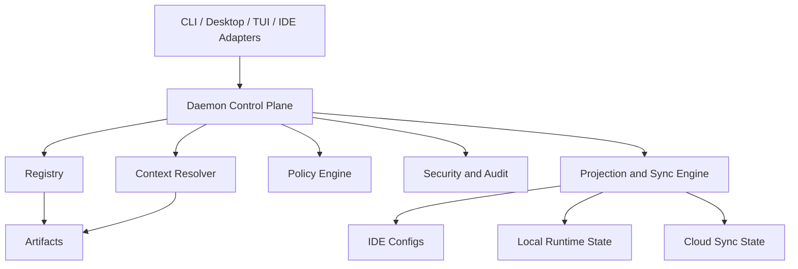

## Overview

This document closes the conceptual architecture for Brain v2 before major implementation work continues.

Brain v2 is a daemon-centered control plane for AI engineering environments. It manages canonical artifacts, resolves hierarchical context and policy, projects final state to client surfaces, and supports local, hybrid, and cloud operation.

## Motivation

The current repository already proves the value of a daemon plus multiple user surfaces. However, the project still mixes implementation, artifacts, and governance concepts in ways that are workable for a local prototype but too loose for a long-lived product.

Before expanding features, Brain needs a closed target architecture that defines:

- what the executable product surfaces are
- what artifacts Brain governs
- how hierarchy and policy work
- where AI runtimes belong
- how development-only and production-safe components are separated

## Goals

- Preserve daemon as the single operational source of truth.
- Keep `cli`, `ui`, and future `tui` as coordinated clients, not peer orchestrators.
- Standardize all managed assets under a unified artifact model.
- Support local-only, cloud-synced, and hybrid user flows.
- Define hard boundaries for identity, policy, security, runtime, and sync.
- Keep the repository root readable and stable.

## Non-Goals

- Replacing daemon orchestration with per-client orchestration.
- Keeping root-level domain sprawl as the long-term repository shape.
- Treating prompts, skills, MCPs, and agents as unrelated systems.
- Allowing production visibility of development-only internal tools.

## High-Level Design

### Product Surfaces

Brain v2 exposes multiple coordinated surfaces:

- `cli`: fast operational interface for scripting and power users
- `desktop`: graphical management and observability surface
- `tui`: optional terminal-native visual surface
- `daemon`: only component allowed to mutate runtime state and resolve final projections

The Docker analogy is intentional: clients may act independently, but all state converges through the daemon.

### Core System Model

Brain v2 is organized into five conceptual planes:

1. Client plane
   - CLI, desktop UI, future TUI, IDE adapters
2. Control plane
   - daemon APIs, orchestration, sync coordination, explainability
3. Governance plane
   - registry, policy, identity, security, audit
4. Artifact plane
   - rules, skills, agents, commands, MCP definitions, providers, AI runtimes
5. Projection plane
   - generated outputs for IDEs, local runtimes, workspace state, cloud sync payloads

### Artifact-First Governance

Everything Brain manages is treated as an artifact with:

- canonical metadata
- origin and trust metadata
- scope and precedence metadata
- sync and lifecycle metadata
- payload references

Artifact kinds include:

- rules
- skills
- agents
- commands
- MCP definitions
- providers
- AI runtimes and models
- templates

### Hierarchical Resolution

Runtime resolution composes active state using explicit hierarchy:

- platform
- organization
- team
- user
- workspace
- project
- session

Hard policy always wins over soft preference. More specific scope may override less specific scope only if policy allows it.

### Runtime and Context Optimization

Brain v2 includes a dedicated AI subsystem that can:

- register local and cloud models
- route tasks based on capability and policy
- build compact context bundles instead of dumping all artifact text
- run internal optimization jobs to deduplicate, consolidate, and promote reusable context

### Memory and Knowledge Coordination

Brain v2 also includes a dedicated memory and knowledge layer that:

- stores structured cross-session knowledge
- supports semantic recall through a vector backend
- enables cross-device continuity when sync is enabled
- assists deduplication and context promotion workflows

`Qdrant` remains an explicit part of this architecture as the primary semantic memory backend currently recognized by Brain. It supports vector recall and similarity workflows, but it is not the canonical source of truth for artifacts or policy.

### Environment Boundaries

Every component and artifact must declare environment posture:

- `prod-safe`
- `dev-only`
- `internal`

Development helpers may live in the repository, but they must not be exposed to production profiles simply because they are implemented as artifacts.

## Canonical Repository Shape

The long-term repository shape is:

- `apps/`
- `core/`
- `artifacts/`
- `internal/`
- `docs/`
- `utils/`
- `deploy/`

Detailed structure is defined in `docs/architecture/repository-structure-v2.md`.

## Implementation Strategy

### Phase 1: Architecture Closure

- Approve ADRs for artifact model, repository structure, hierarchy, and AI runtime.
- Publish target docs and update indexes.

### Phase 2: Registry and Schema Hardening

- Introduce common artifact envelope and schemas.
- Add validation gates.

### Phase 3: Hierarchy, Policy, and Security

- Add identity and scope model.
- Add trust and permission checks.

### Phase 4: Repository Refactor

- Move code and artifacts into final structure.
- Preserve compatibility shims during migration.

### Phase 5: Runtime and Cloud Sync

- Add AI runtime registry.
- Add cloud sync contracts and audit trails.

## Trade-Offs

- Aspect: Architectural closure before implementation
- Option A: Continue iterating in code first
- Option B: Freeze final-state architecture now
- Chosen: B
- Rationale: The system has crossed the threshold where undocumented improvisation would create long-term inconsistency.

- Aspect: Root-level domains
- Option A: Keep many top-level folders
- Option B: Consolidate under `artifacts/`, `apps/`, and `core/`
- Chosen: B
- Rationale: A cleaner root improves governance, onboarding, and maintainability.

## Risks & Mitigation

- Risk: Documentation moves faster than implementation
- Severity: Medium
- Mitigation: Keep all new decisions tied to ADRs and phased migration notes.

- Risk: Refactor size increases migration burden
- Severity: High
- Mitigation: Use compatibility shims and move one subsystem at a time.

- Risk: Over-modeling slows initial delivery
- Severity: Medium
- Mitigation: Only formalize structures that are required for multi-surface, hierarchical, and secure operation.

## Testing Strategy

- [ ] Unit tests for schema parsing and hierarchy resolution
- [ ] Integration tests for sync and projection correctness
- [ ] E2E tests for CLI and desktop parity through daemon

## Success Metrics

- All executable surfaces consume daemon-resolved state only.
- Every managed domain can be represented through the artifact envelope.
- Development-only artifacts are never exposed in production profiles.
- Root-level repository navigation is understandable without prior tribal knowledge.

## Deployment Plan

Roll out through compatibility-preserving phases. Existing paths remain valid during migration, but all new capabilities must be implemented against the final structure.

## Monitoring & Observability

Brain must expose:

- registry load status
- projection drift events
- policy decisions
- trust validation results
- sync success and failure events
- artifact usage and activation traces

## Related Decisions

- `docs/adr/ADR-0002-centralized-brain-cli.md`
- `docs/adr/ADR-0003-central-daemon-orchestration.md`
- `docs/adr/ADR-0005-strict-development-and-production-boundary.md`
- `docs/adr/ADR-0007-unified-capability-control-plane.md`
- `docs/adr/ADR-0008-unified-artifact-packaging-and-lifecycle.md`
- `docs/adr/ADR-0009-clean-repository-structure-and-domain-boundaries.md`
- `docs/adr/ADR-0010-hierarchical-identity-policy-and-security-model.md`
- `docs/adr/ADR-0011-ai-runtime-and-curator-subsystem.md`

---

**Status**: Active
**Reviewed by**: Brain Architecture Team
**Target completion**: 2026-04-30 for architecture closure, phased implementation after approval
