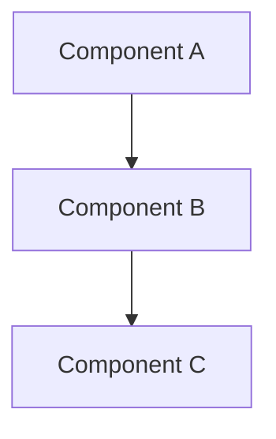

## Design Details

## Overview

[What are we building? Why now?]

## Motivation

[The problem statement and why this matters]

## Goals

- [Goal 1]
- [Goal 2]
- [Goal 3]

## Non-Goals

- [What we explicitly won't do]
- [Out of scope]

## High-Level Design

[Architecture overview. Use Mermaid diagram if helpful.]



## API / Interface

### Data Structures

```typescript
interface ExampleInput {
  field1: string;
  field2: number;
}

interface ExampleOutput {
  result: string;
  status: "success" | "error";
}
```

### Key Functions

```go
func ProcessData(input ExampleInput) (ExampleOutput, error) {
    // Implementation
}
```

## Implementation Strategy

[How will this be built? What are the phases?]

### Phase 1: [Phase Name]

- Task 1
- Task 2

### Phase 2: [Phase Name]

- Task 1
- Task 2

## Trade-Offs

- Aspect: [Aspect]
- Option A: [Pro/Con]
- Option B: [Pro/Con]
- Chosen: [A/B]
- Rationale: [Why?]

## Risks & Mitigation

- Risk: [Risk 1]
- Severity: [High/Med/Low]
- Mitigation: [How we handle]

## Testing Strategy

- [ ] Unit tests: [Coverage %]
- [ ] Integration tests: []
- [ ] E2E tests: []

## Success Metrics

- Metric 1: [How we measure success]
- Metric 2: [Concrete KPI]

## Deployment Plan

[How will this be deployed? Any gradual rollout?]

## Monitoring & Observability

[How will we know if this is working?]

## Related Decisions

- ADR-XXX: [Related architectural decision]

---

**Status**: Active
**Reviewed by**: [Names]
**Target completion**: [Date]
